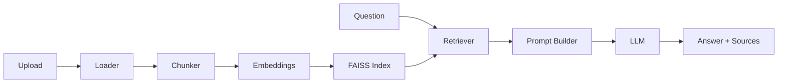

<div align="center">

# AI-Powered Document Q&A Assistant

**Context-grounded document intelligence powered by Retrieval-Augmented Generation**

Upload documents · Build a semantic index · Ask questions · Get cited answers

<br>

[](https://www.python.org/)
[](https://streamlit.io/)
[](https://nexusdocs-ai.streamlit.app)
[](https://github.com/veerendrakalyanbabu-VKB/AI-Document-QA-Assistant)
[](https://github.com/facebookresearch/faiss)
[](LICENSE)

<br>

[Live Demo](https://nexusdocs-ai.streamlit.app) · [Features](#-features) · [Architecture](#-architecture) · [Quick Start](#-quick-start) · [Documentation](#-documentation) · [Author](#-author)

</div>

---

## Overview

An end-to-end **GenAI application** that lets users upload **PDF, DOCX, and TXT** files, index them with **semantic embeddings**, retrieve the most relevant passages with **FAISS**, and generate **grounded answers** using a local **FLAN-T5** model or optional **OpenAI API**.

Built as a portfolio-grade project to demonstrate real-world **RAG**, **prompt engineering**, **vector search**, and **LLM application development**.

---

## Demo

### Live app

**[https://nexusdocs-ai.streamlit.app](https://nexusdocs-ai.streamlit.app)**

> First deploy? See [Streamlit deployment guide](docs/STREAMLIT_DEPLOYMENT.md) — set app URL to `nexusdocs-ai` and add your OpenAI key in Secrets.

| Step | Action |
|------|--------|
| 1 | Upload a document (or click **Demo** for a sample) |
| 2 | Click **Save** to add files to the library |
| 3 | Click **Build knowledge base** |
| 4 | Ask a question in the chat panel |
| 5 | Review the answer and expand **source citations** |

> Run locally: `streamlit run app.py` → [http://localhost:8501](http://localhost:8501)

**NexusDocs AI** is the product name used in the Streamlit interface.

> **Tip:** Add a screenshot at `docs/assets/demo.png` and uncomment the line below for extra impact on GitHub.

<!--  -->

---

## Features

| Capability | Description |
|------------|-------------|
| **Multi-format ingestion** | PDF, DOCX, TXT document upload |
| **Semantic chunking** | Configurable chunk size and overlap |
| **Embeddings** | `sentence-transformers/all-MiniLM-L6-v2` |
| **Vector retrieval** | FAISS top-k similarity search |
| **Grounded generation** | FLAN-T5 (local) or OpenAI (optional) |
| **Source citations** | Expandable passages with real FAISS similarity scores |
| **Modern UI** | NexusDocs AI command center, pipeline tracker, quick actions |
| **Test coverage** | Unit tests for core RAG components |

---

## Architecture



<details>
<summary><strong>Pipeline stages</strong></summary>

```text
Upload → Ingest → Chunk → Embed → Index → Retrieve → Generate → Streamlit UI
```

</details>

---

## Tech Stack

| Layer | Technology |
|-------|------------|
| Language | Python |
| UI | Streamlit |
| Orchestration | LangChain |
| Embeddings | Hugging Face / Sentence Transformers |
| Vector DB | FAISS |
| LLM | FLAN-T5 · OpenAI API |
| Parsing | PyPDF · python-docx |
| Testing | pytest |

---

## Quick Start

### Prerequisites

- Python 3.10+
- Git

### Installation

```bash
git clone https://github.com/veerendrakalyanbabu-VKB/AI-Document-QA-Assistant.git
cd AI-Document-QA-Assistant
python -m venv .venv
```

**Windows**
```bash
.venv\Scripts\activate
pip install -r requirements.txt
pip install -r requirements-local.txt
```

**macOS / Linux**
```bash
source .venv/bin/activate
pip install -r requirements.txt
pip install -r requirements-local.txt
```

> `requirements-local.txt` adds FLAN-T5 + Hugging Face embeddings for **offline local** use. Streamlit Cloud only needs `requirements.txt` + OpenAI API key.

### Configuration (optional)

```bash
copy .env.example .env   # Windows
# cp .env.example .env   # macOS/Linux
```

```env
OPENAI_API_KEY=your-key-here
OPENAI_MODEL=gpt-4o-mini
OPENAI_EMBEDDING_MODEL=text-embedding-3-small
```

Without an API key, install `requirements-local.txt` and the app uses local FLAN-T5 + Hugging Face embeddings.

### Run

```bash
streamlit run app.py
```

Open **[http://localhost:8501](http://localhost:8501)**

---

## Project Structure

```text
AI-Document-QA-Assistant/
├── app.py                  # Streamlit entry point
├── src/
│   ├── config.py           # Environment & paths
│   ├── document_loader.py  # PDF / DOCX / TXT parsing
│   ├── chunker.py          # Text splitting
│   ├── embeddings.py       # Hugging Face embeddings
│   ├── vector_store.py     # FAISS build & load
│   ├── retriever.py        # Semantic retrieval
│   ├── ingestion.py        # Upload & indexing workflow
│   ├── rag_pipeline.py     # RAG + LLM generation
│   └── ui/                 # UI components & theme
├── tests/                  # Unit tests
├── docs/                   # Architecture & interview guide
└── .streamlit/config.toml  # App theme
```

---

## Testing

```bash
pytest tests/ -v
```

---

## Documentation

| Resource | Description |
|----------|-------------|
| [Architecture](docs/ARCHITECTURE.md) | System design and component breakdown |
| [Interview Guide](docs/INTERVIEW_GUIDE.md) | How to explain RAG in interviews |
| [Streamlit Deployment](docs/STREAMLIT_DEPLOYMENT.md) | Deploy the live demo (free) |

---

## What This Project Demonstrates

- End-to-end **RAG** implementation
- **Document chunking** for retrieval precision
- **Embedding** and **semantic search** concepts
- **Prompt design** for grounded, low-hallucination answers
- **Python + API** integration with LLMs
- Production-minded **project structure**, tests, and documentation

---

## Roadmap

- [x] Streamlit Cloud deployment
- [ ] Hybrid retrieval (semantic + keyword)
- [ ] Evaluation harness for answer quality
- [ ] Demo screenshot in README

---

## Author

**Veerendra Kalyan**

AI / GenAI Portfolio Project · 2026

- GitHub: [@veerendrakalyanbabu-VKB](https://github.com/veerendrakalyanbabu-VKB)
- Repository: [AI-Document-QA-Assistant](https://github.com/veerendrakalyanbabu-VKB/AI-Document-QA-Assistant)

---

## License

This project is licensed under the **MIT License**. See [LICENSE](LICENSE) for details.

<div align="center">

⭐ **If this project helped you, consider starring the repository!**

</div>
